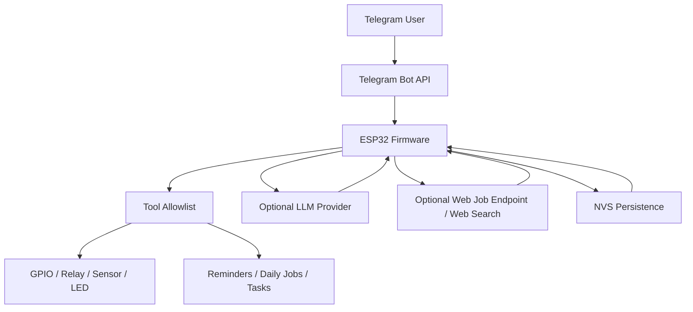

# MicroClaw
<p align="center">
  
</p>

MicroClaw is an ESP32-based autonomous Telegram agent. It runs directly on-device, executes only allowlisted tools, supports optional LLM providers, and can schedule reminders/web jobs while keeping state in NVS.

## Overview

- Primary firmware target: `wroom_brain_pio` (Arduino + PlatformIO, actively used)
- Secondary scaffold: `wroom_brain` (ESP-IDF baseline, Telegram transport still stubbed)
- Transport: Telegram Bot API polling + sendMessage/sendDocument/sendPhoto
- Persistence: on-device NVS (memory, tasks, persona, reminder settings, logs)
- LLM: optional (`openai`, `anthropic`, `gemini`, `glm`) for planning/chat/routing

## Repository Layout

```text
microclaw/
|-- README.md
|-- wroom_brain/                 # ESP-IDF scaffold (early-stage)
|   |-- main/
|   `-- README.md
`-- wroom_brain_pio/             # Main firmware (PlatformIO + Arduino)
    |-- include/
    |-- scripts/load_env.py       # Generates include/brain_secrets.generated.h from .env
    |-- src/
    |-- .env.example
    |-- platformio.ini
    `-- README.md
```

## Architecture



## Features

- Telegram command handling with allowlist-first execution
- Optional natural-language routing to tool commands
- General LLM chat fallback when no explicit command matches
- Planning tool: `plan <task>`
- Daily reminders and daily web jobs
- On-device memory and task management
- Email draft storage
- Event logs
- Image generation command (`generate_image <prompt>`)
- Web file generator command (`web_files_make [topic]`) with file delivery via Telegram

## Supported Commands (Current)

Core:
- `status`
- `help`
- `health`

Actuation and safety:
- `relay_set <pin> <0|1>` (confirm required)
- `flash_led [1-20]` (confirm required)
- `sensor_read <pin>`
- `confirm [id]`
- `cancel`
- `safe_mode`
- `safe_mode_on`
- `safe_mode_off`

LLM and content:
- `plan <task>`
- `generate_image <prompt>`

Memory/persona:
- `remember <note>`
- `memory`
- `forget`
- `soul_show`
- `soul_set <text>`
- `soul_clear`
- `heartbeat_show`
- `heartbeat_set <text>`
- `heartbeat_clear`

Time, reminders, jobs:
- `time_show`
- `timezone_show`
- `timezone_set <Zone>`
- `timezone_clear`
- `reminder_set_daily <HH:MM> <message>`
- `reminder_show`
- `reminder_clear`
- `webjob_set_daily <HH:MM> <task>`
- `webjob_show`
- `webjob_run`
- `webjob_clear`

Tasks/email/logs:
- `task_add <text>`
- `task_list`
- `task_done <id>`
- `task_clear`
- `email_draft <to>|<subject>|<body>`
- `email_show`
- `email_clear`
- `logs`
- `logs_clear`

Web files:
- `web_files_make [topic]`
- Natural prompts like:
  - `create html file for saas website and send`
  - `make the website more stunning`

## Hardware Requirements

- ESP32 development board (`esp32dev` target in PlatformIO)
- USB cable with data support
- Optional:
  - Relay/sensor hardware for GPIO commands
  - Stable power supply for long-running autonomous mode

## Software Requirements

- Python 3.11+ (or compatible)
- PlatformIO Core (`pio`) or `python -m platformio`
- Telegram bot token from BotFather

## Quick Start (Recommended: PlatformIO Firmware)

1. Enter the firmware folder:

```powershell
cd wroom_brain_pio
```

2. Create local environment file:

```powershell
copy .env.example .env
```

3. Fill required `.env` keys:
- `WIFI_SSID`
- `WIFI_PASS`
- `TELEGRAM_BOT_TOKEN`
- `TELEGRAM_ALLOWED_CHAT_ID`

4. Build:

```powershell
python -m platformio run
```

5. Flash:

```powershell
python -m platformio run -t upload --upload-port COMx
```

6. Monitor:

```powershell
python -m platformio device monitor -b 115200 -p COMx
```

## Get Telegram Allowed Chat ID

- Send any message to your bot first.
- Open:
  `https://api.telegram.org/bot<YOUR_BOT_TOKEN>/getUpdates`
- Copy your chat `id` and set it as `TELEGRAM_ALLOWED_CHAT_ID`.

## Configuration Reference (`wroom_brain_pio/.env`)

Required:
- `WIFI_SSID`
- `WIFI_PASS`
- `TELEGRAM_BOT_TOKEN`
- `TELEGRAM_ALLOWED_CHAT_ID`

Important optional groups:

- Polling and autonomy:
  - `TELEGRAM_POLL_MS`
  - `AUTONOMOUS_STATUS_ENABLED`
  - `AUTONOMOUS_STATUS_MS`
  - `HEARTBEAT_ENABLED`
  - `HEARTBEAT_INTERVAL_MS`
- LLM:
  - `LLM_PROVIDER=none|openai|anthropic|gemini|glm`
  - `LLM_API_KEY`
  - `LLM_MODEL`
  - `LLM_*_BASE_URL`
  - `LLM_TIMEOUT_MS`
- Web jobs/search:
  - `WEB_JOB_ENDPOINT_URL`
  - `WEB_JOB_API_KEY`
  - `WEB_JOB_TIMEOUT_MS`
  - `WEB_SEARCH_PROVIDER=auto|tavily|ddg`
  - `WEB_SEARCH_API_KEY`
  - `WEB_SEARCH_BASE_URL`
  - `WEB_SEARCH_TIMEOUT_MS`
- Image generation:
  - `IMAGE_PROVIDER=none|gemini|openai`
  - `IMAGE_API_KEY`

Defaults and validation behavior are implemented in:
- `wroom_brain_pio/scripts/load_env.py`
- `wroom_brain_pio/include/brain_config.h`

## LLM Provider Endpoints (Default)

- OpenAI: `https://api.openai.com/v1/chat/completions`
- Anthropic: `https://api.anthropic.com/v1/messages`
- Gemini: `https://generativelanguage.googleapis.com/v1beta/models/{model}:generateContent`
- GLM: `https://api.z.ai/api/coding/paas/v4/chat/completions`

## ESP-IDF Scaffold (Secondary)

`wroom_brain` is kept as an ESP-IDF scaffold for architecture parity and future expansion.

Build commands:

```bash
cd wroom_brain
idf.py set-target esp32
idf.py build
idf.py -p <PORT> flash monitor
```

## Troubleshooting

Bot does not reply:
- Verify Wi-Fi and Telegram token in `.env`
- Verify `TELEGRAM_ALLOWED_CHAT_ID` is correct for your chat
- Confirm bot receives updates via `getUpdates`

`ERR: LLM HTTP 429`:
- Provider quota/plan limit reached; check billing/quota

`ERR: Could not parse provider response`:
- Reflash latest firmware (parser robustness was improved)

Upload fails with boot mode errors:
- Hold `BOOT` while starting upload, release once writing starts
- Ensure no serial monitor/process is locking the COM port

`pio` not recognized:
- Use `python -m platformio ...` directly

## Security Notes

- Current TLS path uses `client.setInsecure()` for fast bring-up.
- For production, pin CA/certificates and avoid insecure TLS.
- Keep `.env` private and never commit real tokens/API keys.
- Restrict your Telegram bot usage with `TELEGRAM_ALLOWED_CHAT_ID`.

## Development Workflow

1. Update `.env` locally (never commit secrets)
2. Build and flash
3. Validate via serial monitor and Telegram tests
4. Commit code-only changes

## Roadmap Ideas

- Hardened TLS with certificate pinning
- Signed command execution (HMAC + nonce window)
- Persistent queue and crash-safe replay guard
- Expanded hardware drivers and OTA update flow
- Richer web-file generation packs and multi-file templates
