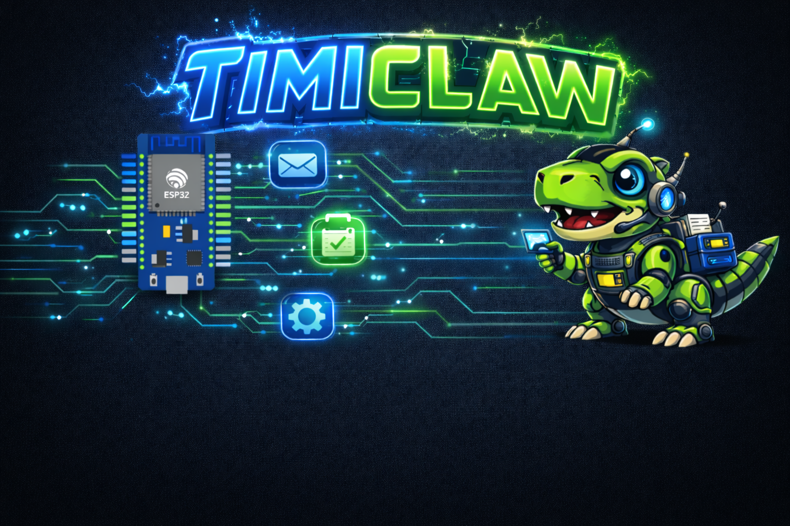

# TimiClaw Firmware (ESP32 + PlatformIO)
<p align="center">
  
</p>

`wroom_brain_pio` is the main firmware for TimiClaw. It runs an ESP32 Telegram AI agent with allowlisted tools, optional multi-provider LLM chat, file generation, and an onboard web dashboard.

## What Is Working Now

- Telegram command and chat handling on ESP32
- Optional LLM providers: `gemini`, `openai`, `anthropic`, `glm`, `openrouter`, `ollama`
- Natural-language routing to internal tools
- Robust code/file delivery to Telegram (with retry)
- Web file generation and hosting from ESP32 storage
- Natural web iteration for existing files in `/projects/...`
- First-time onboarding (6 steps):
  - timezone
  - provider
  - key setup
  - user nickname
  - bot name
  - bot purpose
- Context reset command (`fresh_start`) that keeps `/projects`
- Web dashboard at `http://<ESP32-IP>/`

## Quick Start

1. Create local env file:

```powershell
copy .env.example .env
```

2. Fill required values in `.env`:
- `WIFI_SSID`
- `WIFI_PASS`
- `TELEGRAM_BOT_TOKEN`
- `TELEGRAM_ALLOWED_CHAT_ID`

3. Build, flash, and upload filesystem:

```powershell
pio run -t upload
pio run -t uploadfs
pio device monitor -b 115200
```

## Natural Website Workflow (Recommended)

Use natural prompts, but include a target path when editing existing files.

Examples:
- `create a saas landing page and send files`
- `update /projects/saas_template/index.html and make it red`
- `make /projects/saas_template/index.html more stunning`
- `host it`
- `list projects`

Behavior:
- New generation sends files as Telegram documents.
- Iteration updates the same file path when you specify `/projects/...`.
- `host it` prefers HTML entrypoints and avoids serving raw `.js` as page root.

## Onboarding

- First message (`/start`) triggers setup if onboarding is incomplete.
- Commands:
  - `onboarding_start`
  - `onboarding_status`
  - `onboarding_skip`

Identity choices from onboarding are saved into on-device profile memory (`USER.md` and `SOUL.md` profile block).

## Core Commands

- `/start`, `/help`, `/status`, `/health`, `/specs`, `/usage`
- `/timezone_set <zone>`, `/timezone_show`
- `/model list`, `/model status`, `/model use <provider>`, `/model set <provider> <key>`
- `/web_files_make [topic]`, `host it`
- `/fresh_start` (clear conversation context, keep `/projects`)
- `/memory`, `/remember <note>`, `/forget`
- `/skills`, `/skill_show <name>`, `/skill_add ...`, `/use_skill ...`
- `/minos <cmd>`

Hardware and utility commands:
- `/relay_set <pin> <0|1>`
- `/flash_led [count]`
- `/search <query>`
- `/logs`, `/logs_clear`
- `/cron_add <expr> | <cmd>`, `/cron_list`, `/cron_clear`
- `/cron_add <HH:MM> | <cmd>` (shortcut for daily time-based cron)
- `/reminder_set_daily <HH:MM> <message>`, `/reminder_show`, `/reminder_clear`

## Configuration Notes

- Env values are compiled into firmware via `scripts/load_env.py` -> `include/brain_secrets.generated.h`.
- Gemini default endpoint should be:
  - `https://generativelanguage.googleapis.com`
- For image generation:
  - set `IMAGE_PROVIDER` and `IMAGE_API_KEY`
  - if unset, firmware can fall back to `LLM_PROVIDER`/`LLM_API_KEY` for compatible providers

## Troubleshooting

Bot does not reply:
- Verify `TELEGRAM_ALLOWED_CHAT_ID` by calling Bot API `getUpdates`.
- Confirm Wi-Fi and token are valid.
- Confirm bot was flashed after env changes.

`ERR: Could not parse provider response`:
- Usually provider payload mismatch or old firmware build.
- Rebuild and reflash latest firmware.

`ERR: LLM HTTP -1`:
- Transport timeout/network/TLS failure.
- Check Wi-Fi quality, endpoint URL, key validity, and provider rate limits.

Upload issues:
- Hold `BOOT` while upload starts if needed.
- Close any serial monitor locking the COM port.

## Security

- Current TLS uses insecure mode for development (`setInsecure`).
- Keep `.env` private and never commit real tokens.
- Restrict bot access with `TELEGRAM_ALLOWED_CHAT_ID`.

## Project Scope

This folder is the active production firmware target.
The sibling `wroom_brain` ESP-IDF project is a secondary scaffold.
